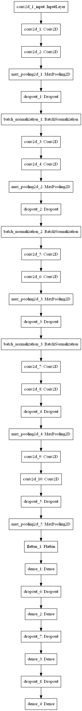

# Chess Piece Classification

Chess piece classification CNN built with TensorFlow.

## Introduction

Our model has a 94% validation accuracy for our chess piece classes. Below is a plot of the [model](model.png) architecture. 

### Prerequisites

See `requirements.txt` or run `pip install -r requirements.txt`.

The `plot_model` Keras function requires GraphViz to be installed and in PATH.

### Preprocessing

The first step to training the model is running `preprocessing.py` to generate your custom dataset with preprocessing methods that are included in the script.

By default our model uses data that is preprocessed with `canny.py`, however `adaptive_threshold.py` can be applied on the data preprocessing functionality instead.

### Training

Once the required data is generated, run `train_model.py` to train the model. The resulting model weights will be saved to a file in the [weights](weights/) directory with a name that corresponds to the number of epochs which the model was run with.

### Running

To run the model, run `test_model.py`. The arguments for this script are as follows:
- Weights file to load model weights from
- List of paths to picture to use in prediction

Example: `python test_model.py 720_epoch_model_weights.h5 <path_to_picture>`

## Authors

- [Eric Arthur](https://github.com/etarthur)
- [Josue Contreras](https://github.com/JosuContrer)
- [Przemek Gardias](https://github.com/pgardias)

See also the list of [contributors](https://github.com/etarthur/chess-piece-classification/graphs/contributors) who participated in this project.

## License

This project is licensed under the MIT License - see the [LICENSE](LICENSE) file for details.
